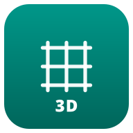

<div align="center">

<picture>
  
</picture>

# 3DPrintForge Slicer

**A fleet-aware FDM slicer with built-in dashboard integration.**

[](https://github.com/skynett81/3dprintforge-slicer/actions/workflows/3dprintforge-build.yml)
[](https://github.com/skynett81/3dprintforge-slicer/releases)

</div>

3DPrintForge Slicer is the desktop companion to
[3DPrintForge](https://github.com/skynett81/3dprintforge), a self-hosted
dashboard for managing fleets of 3D printers across 17 brands and
protocols (Bambu Lab, Snapmaker, Prusa, Klipper/Moonraker, OctoPrint,
AnkerMake, and more).

It is a divergent fork of [OrcaSlicer](https://github.com/OrcaSlicer/OrcaSlicer)
at upstream commit `f4d34219b8`. Everything OrcaSlicer can do, this can
do — plus a REST service for headless slicing, a config that lives
next to 3DPrintForge's printer/spool database, and a Forge Library
panel that surfaces 3DPrintForge's 51 parametric model generators
directly inside the slicer GUI.

## What's different from upstream OrcaSlicer

| Area | Upstream OrcaSlicer | 3DPrintForge Slicer |
|---|---|---|
| Binary name | `orca-slicer` | `3dprintforge-slicer` |
| Config dir | `~/.config/OrcaSlicer/` | `~/.config/3DPrintForgeSlicer/` (auto-migrates legacy on first launch) |
| REST service | none | 9 endpoints under `/api/`, SSE streaming on `/api/slice/stream`, headless `--rest-only` mode |
| GUI integration | — | "Forge" top-level menu with the Forge Library catalog of 3DPrintForge's parametric generators |
| Upstream strategy | continuous merges from PrusaSlicer/BambuStudio | full divergence; no further merges from OrcaSlicer planned |

## REST service

When built with `-DENABLE_FORGE_REST=ON` (the default for the CI
artifacts), the binary accepts new CLI flags and exposes an HTTP API:

```bash
# headless, REST only — what 3DPrintForge drives
3dprintforge-slicer --rest-port 8765 --rest-only

# alongside the GUI — REST shares the same PresetBundle
3dprintforge-slicer --rest-port 8765
```

```
GET  /api/health                       service + version info
GET  /api/version                      lightweight version probe
GET  /api/profiles?kind=printer|...    list profiles, filterable
GET  /api/profiles/{id}                full preset settings
GET  /api/printers                     printer-kind profiles only
POST /api/slice                        buffered JSON, real slice
POST /api/slice/stream                 Server-Sent Events with per-stage progress
GET  /api/jobs                         all jobs sliced this session
GET  /api/jobs/{id}/gcode              download generated gcode
```

Full request/response shapes live in
[`src/forge/README.md`](src/forge/README.md) alongside the
implementation.

## Forge Library (GUI)

The `Forge` menu opens a dialog with the catalog of 3DPrintForge's
parametric generators (Gridfinity bins, gears, lithophanes, NFC
filament tags, calibration tools, and more). Clicking
**Generate with defaults** POSTs to the dashboard's
`/api/model-forge/{id}/generate-3mf` endpoint, receives the 3MF in
the background, and drops it onto the active plate.

Override the dashboard URL with `FORGE_DASHBOARD_URL` if 3DPrintForge
runs somewhere other than `https://localhost:3443`.

## Building from source (Linux)

```bash
# 1. System deps (Ubuntu/Debian, Arch equivalents in build_linux.sh)
sudo apt-get install -y cmake ninja-build build-essential \
  libgtk-3-dev libgl1-mesa-dev libglu1-mesa-dev libegl1-mesa-dev \
  libcurl4-openssl-dev libssl-dev libudev-dev libxxf86vm-dev \
  libdbus-1-dev libxrandr-dev libxi-dev libxinerama-dev libxcursor-dev \
  libwebkit2gtk-4.1-dev libgstreamer1.0-dev \
  libgstreamer-plugins-base1.0-dev libxkbcommon-dev libwayland-dev \
  libnotify-dev libsm-dev libsecret-1-dev libsoup-3.0-dev autoconf

# 2. Vendored deps (boost, wxWidgets, OpenVDB, CGAL, TBB...) — ~30 min
cd deps
cmake -B build -G Ninja -DCMAKE_BUILD_TYPE=Release \
  -DDESTDIR="$PWD/build/destdir"
cmake --build build

# 3. The slicer itself — ~15 min
cd ..
cmake -B build -G Ninja -DCMAKE_BUILD_TYPE=Release \
  -DCMAKE_PREFIX_PATH="$PWD/deps/build/destdir/usr/local" \
  -DENABLE_FORGE_REST=ON
cmake --build build --target OrcaSlicer

# Binary lives at build/src/3dprintforge-slicer
```

## Releases

CI on `ubuntu-24.04` produces both a raw tarball and a Linux AppImage
on every push to `main`. On tag push (`v*`), both are attached to a
drafted GitHub Release. See [Releases](https://github.com/skynett81/3dprintforge-slicer/releases).

## Credits & lineage

3DPrintForge Slicer is built on the work of every slicer upstream of
it:

- **Slic3r** (Alessandro Ranellucci, the RepRap community) — foundation
- **PrusaSlicer** (Prusa Research) — calibration, multi-material
- **Bambu Studio** (Bambu Lab) — UI, AMS support, multi-plate
- **SuperSlicer** (Merill et al.) — community enhancements
- **OrcaSlicer** (SoftFever and contributors) — advanced calibration,
  precise wall/seam control, the codebase we forked from

If you find this fork useful, please also support upstream OrcaSlicer.

## Licence

AGPL-3.0 — same as upstream. See [LICENSE.txt](LICENSE.txt).
